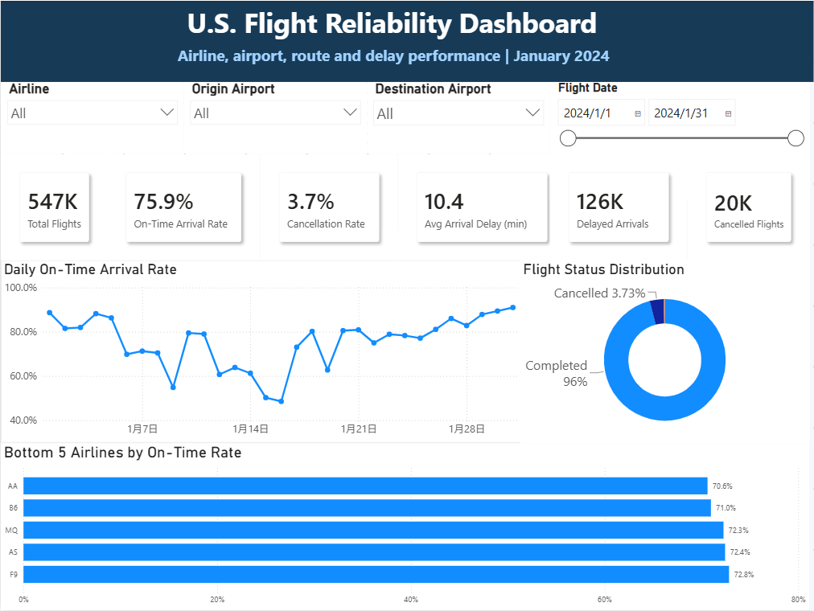
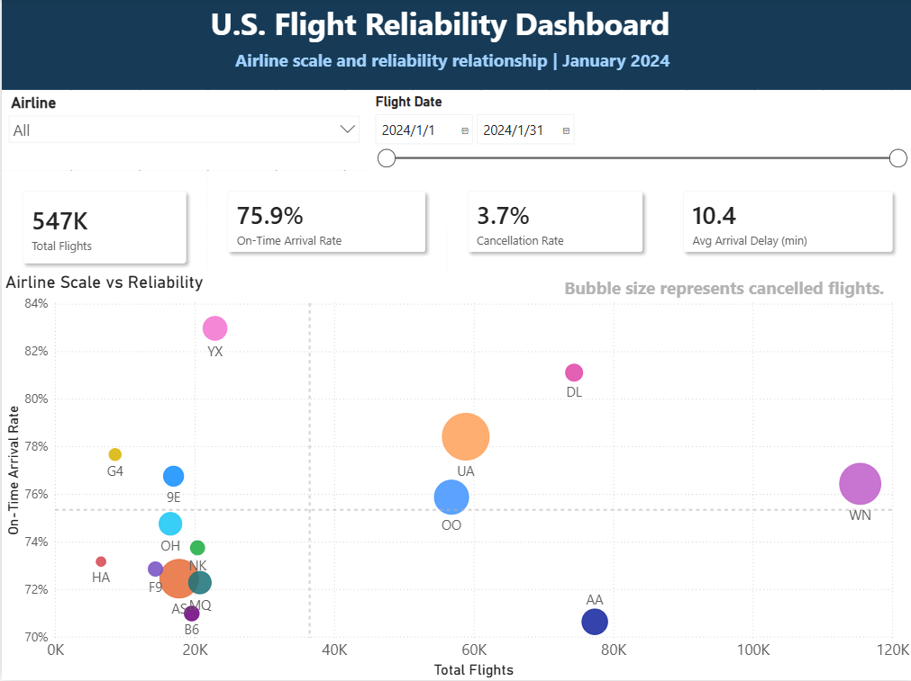
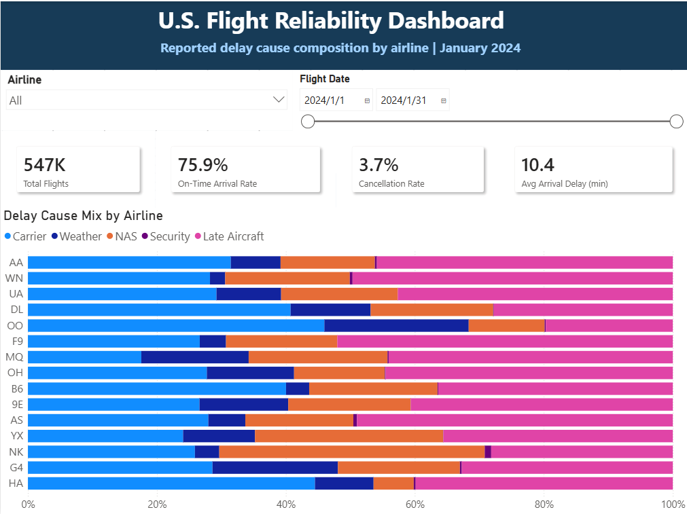
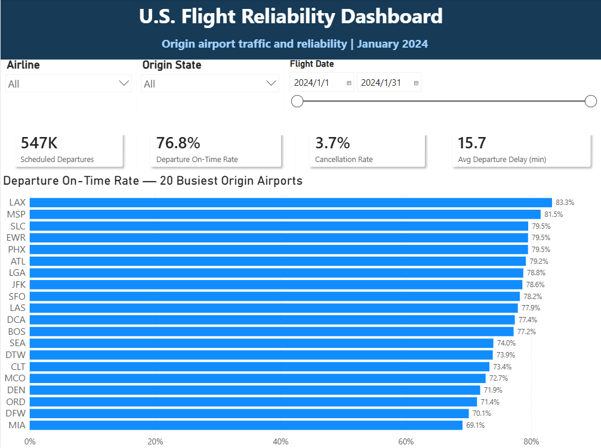
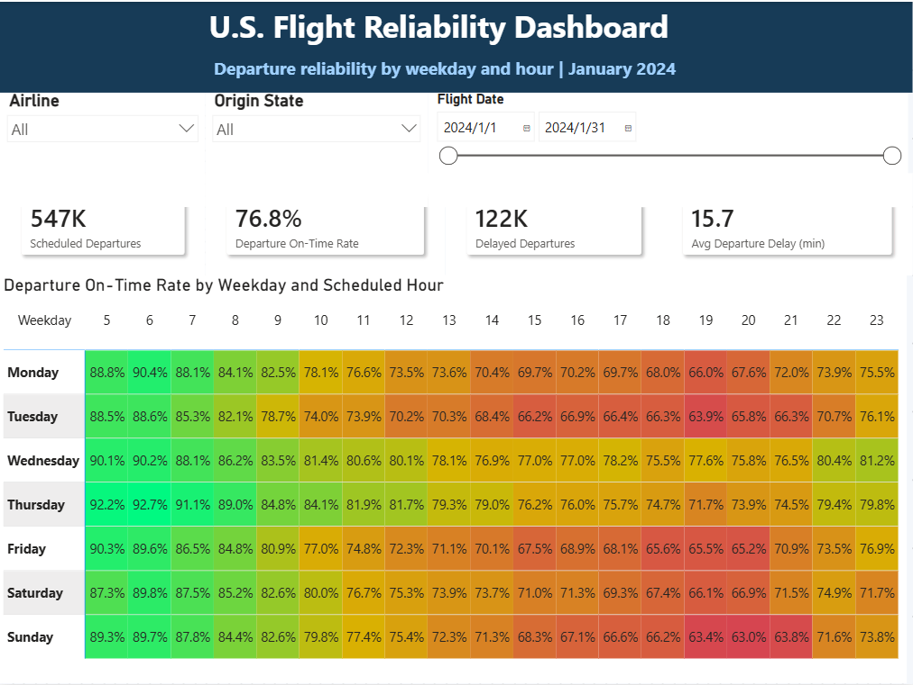
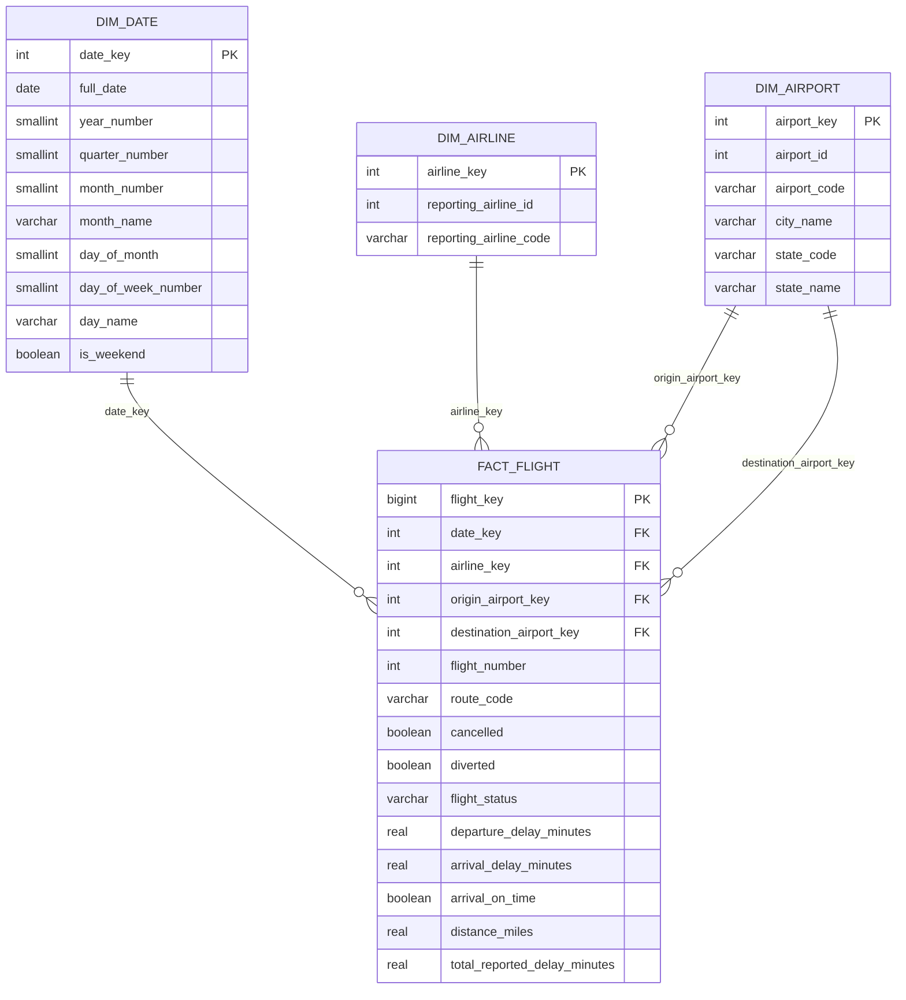

<div align="center">

# ✈️ U.S. Flight Reliability Intelligence Platform

### End-to-End Data Engineering · PostgreSQL Warehouse · SQL Analytics · Power BI


A reproducible analytics platform that transforms official U.S. flight-performance data into a validated Parquet dataset, PostgreSQL star schema, analytical SQL layer, and interactive Power BI report.

</div>

---

## 📌 Table of Contents

- [Project Overview](#-project-overview)
- [Key Results](#-key-results)
- [Business Questions](#-business-questions)
- [Dashboard Preview](#-dashboard-preview)
- [Dashboard Pages](#-dashboard-pages)
- [Architecture](#-architecture)
- [Data Source](#-data-source)
- [Technology Stack](#-technology-stack)
- [Data Warehouse Design](#-data-warehouse-design)
- [Data Quality Framework](#-data-quality-framework)
- [Data Cleaning and Transformation](#-data-cleaning-and-transformation)
- [Metric Definitions](#-metric-definitions)
- [Selected Insights](#-selected-insights)
- [Project Structure](#-project-structure)
- [Local Setup](#-local-setup)
- [Running the Pipeline](#-running-the-pipeline)
- [Power BI Report](#-power-bi-report)
- [Engineering Notes](#-engineering-notes)
- [Current Status](#-current-status)
- [Limitations](#-limitations)
- [Future Improvements](#-future-improvements)
- [Skills Demonstrated](#-skills-demonstrated)

---

# 🚀 Project Overview

The **U.S. Flight Reliability Intelligence Platform** is an end-to-end data engineering and business intelligence project built using official flight-performance data from the U.S. Bureau of Transportation Statistics.

The project covers the complete analytics lifecycle:

```text
Raw CSV
   ↓
Data Profiling
   ↓
Raw Data Validation
   ↓
Cleaning and Transformation
   ↓
Compressed Parquet Dataset
   ↓
PostgreSQL Star Schema
   ↓
Warehouse Validation
   ↓
SQL Analytics Views
   ↓
Power BI Dashboard
```

The current pilot dataset contains reporting-carrier flight records for:

```text
January 2024
```

The project was designed to demonstrate more than dashboard creation. It includes reproducible Python pipelines, validation rules, dimensional modelling, bulk database loading, SQL analytics, DAX measures, and technical documentation.

---

# 📊 Key Results

| Metric | Result |
|---|---:|
| Scheduled flights | 547,271 |
| Completed flights | 525,370 |
| Cancelled flights | 20,389 |
| Diverted flights | 1,512 |
| Reporting airlines | 15 |
| Airports | 334 |
| Arrival on-time rate | 75.9% |
| Departure on-time rate | 76.8% |
| Cancellation rate | 3.7% |
| Delayed arrivals | 126,410 |
| Delayed departures | 122,259 |
| Average arrival delay | 10.4 minutes |
| Average departure delay | 15.7 minutes |
| Raw CSV size | Approximately 141 MB |
| Clean Parquet size | Approximately 19.76 MB |

> The Parquet output is approximately **86% smaller** than the original CSV while preserving analytical data types.

---

# ❓ Business Questions

The platform was designed to answer practical operational questions.

### Overall reliability

- What percentage of flights arrive on time?
- What percentage of departures leave on time?
- How frequently are flights cancelled or diverted?
- How does reliability change throughout the month?

### Airline performance

- Which airlines have the highest and lowest on-time rates?
- Does a larger operating scale lead to better reliability?
- Which airlines have the highest cancellation rates?
- How do delay causes differ across airlines?

### Airport performance

- Which major origin airports have the strongest departure reliability?
- Which busy airports experience the highest average departure delay?
- How does airport performance change by airline or state?

### Route performance

- Which high-traffic routes have the strongest and weakest reliability?
- Does route traffic volume relate to on-time arrival performance?
- Which routes combine high traffic with elevated delay risk?

### Time patterns

- Which weekdays have the best departure performance?
- Which scheduled departure hours have the highest delay risk?
- Does reliability generally decline later in the day?

---

# 🖼️ Dashboard Preview

## 1. Executive Overview

The executive overview summarizes:

- Total flight volume
- Arrival on-time rate
- Cancellation rate
- Average arrival delay
- Delayed arrivals
- Cancelled flights
- Daily on-time trend
- Flight-status distribution
- Bottom five airlines by on-time rate



---

## 2. Airline Scale vs Reliability

This scatter plot compares airline operating scale with reliability.

- **X-axis:** total scheduled flights
- **Y-axis:** on-time arrival rate
- **Bubble size:** cancelled flights



---

## 3. Delay Cause Mix

This view compares the proportional composition of reported delay causes across airlines.

The five BTS delay categories are:

- Carrier
- Weather
- National Air System
- Security
- Late aircraft



---

## 4. Airport Ranking

This page compares departure on-time performance across the 20 busiest origin airports.



---

## 5. Time Patterns

The heatmap shows how departure reliability changes across weekdays and scheduled departure hours.



---

# 📑 Dashboard Pages

The Power BI report contains eight analytical pages.

## 1. Executive Overview

High-level operational summary containing:

- Overall KPIs
- Daily reliability trend
- Flight-status distribution
- Bottom five airlines by on-time rate

## 2. Airline Ranking

Ranks all 15 reporting airlines by on-time arrival rate.

## 3. Airline Comparison Table

Provides a detailed comparison of:

- Total flights
- On-time arrival rate
- Cancellation rate
- Average arrival delay
- Delayed arrival rate

## 4. Airline Scale vs Reliability

Compares:

- Airline operating scale
- Arrival reliability
- Cancellation volume

## 5. Delay Cause Mix

Displays each airline's proportional delay composition across five reported delay categories.

## 6. Airport Ranking

Compares departure performance among the 20 busiest origin airports.

## 7. Route Reliability

Uses a column-and-line combination chart:

- Columns represent scheduled flights
- The line represents on-time arrival rate

## 8. Time Patterns

Uses a matrix heatmap to compare departure on-time rates by:

- Weekday
- Scheduled departure hour

---

# 🏗️ Architecture


### Pipeline layers

| Layer | Purpose |
|---|---|
| Raw | Original BTS CSV stored without modification |
| Interim | Profiling, validation, and temporary loading outputs |
| Processed | Clean analytical Parquet dataset |
| Warehouse | PostgreSQL star schema |
| Analytics | SQL views for reporting and Power BI |
| Presentation | Interactive Power BI dashboard |

---

# 🛫 Data Source

The project uses the official:

## Reporting Carrier On-Time Performance (1987–present)

Provider:

**U.S. Department of Transportation — Bureau of Transportation Statistics**

Data portal:

[https://www.transtats.bts.gov/](https://www.transtats.bts.gov/)

### Pilot data selection

| Setting | Selection |
|---|---|
| Geography | All |
| Year | 2024 |
| Period | January |
| Reporting level | Scheduled flight segment |
| Raw records | 547,271 |
| Selected source columns | 48 |

The raw CSV is intentionally excluded from Git because of its size.

Expected local path:

```text
data/raw/flights_2024_01.csv
```

---

# 🧰 Technology Stack

## Data Engineering

- Python
- pandas
- PyArrow
- Parquet
- python-dotenv

## Database

- PostgreSQL 18
- psycopg 3
- SQLAlchemy
- PostgreSQL `COPY`
- Star schema modelling

## Data Quality

- Structural validation
- Schema validation
- Business-rule validation
- Duplicate detection
- Foreign-key checks
- Source-to-warehouse reconciliation

## Analytics and Visualisation

- SQL analytical views
- Power BI Desktop
- DAX measures
- Slicers and cross-filtering
- Conditional formatting
- Matrix heatmaps
- Scatter plots
- Combination charts
- KPI cards

## Development Tools

- Visual Studio Code
- Git
- GitHub
- PowerShell
- Python virtual environment

---

# 🗄️ Data Warehouse Design

The PostgreSQL warehouse follows a star-schema design.



## Dimension tables

### `warehouse.dim_date`

Stores one row for each calendar date.

### `warehouse.dim_airline`

Stores one row for each reporting airline.

### `warehouse.dim_airport`

Stores one row for each airport.

The same dimension is reused for:

- Origin airport
- Destination airport

## Fact table

### `warehouse.fact_flight`

Stores one row for each scheduled flight segment.

The fact table includes:

- Flight number
- Tail number
- Route
- Scheduled and actual times
- Departure delay
- Arrival delay
- Taxi time
- Flight duration
- Distance
- Cancellation status
- Diversion status
- Flight status
- Delay causes
- Arrival outcome

---

# 🔎 Analytical SQL Views

The reporting layer contains reusable PostgreSQL views.

| View | Purpose |
|---|---|
| `analytics.vw_flight_detail` | Denormalized flight-level analytical view |
| `analytics.vw_overview_metrics` | Overall KPIs |
| `analytics.vw_daily_performance` | Daily reliability trends |
| `analytics.vw_airline_performance` | Airline-level comparison |
| `analytics.vw_origin_airport_performance` | Origin-airport performance |
| `analytics.vw_route_performance` | Route-level reliability |
| `analytics.vw_departure_hour_performance` | Scheduled-hour analysis |
| `analytics.vw_delay_cause_by_airline` | Delay causes in long format |

Power BI currently imports:

```text
analytics vw_flight_detail
```

This view contains the joined fact and dimension attributes required by the dashboard.

---

# ✅ Data Quality Framework

Validation is performed at three separate stages.

## 1. Raw Data Validation

Checks include:

- Required columns
- Invalid dates
- Date-part consistency
- Missing flight identifiers
- Exact duplicate rows
- Duplicate flight keys
- Invalid cancellation indicators
- Invalid diversion indicators
- Negative unsigned values
- Departure delay-indicator consistency
- Arrival delay-indicator consistency
- Cancellation-code consistency
- Origin and destination consistency

Result:

```text
Overall status: PASS
```

## 2. Clean Data Validation

Checks include:

- Required transformed fields
- Empty dataset
- Invalid reporting period
- Missing flight keys
- Duplicate flight keys
- Invalid flight status
- Cancelled and diverted conflicts
- Route-code consistency
- Weekend-indicator consistency
- Scheduled-hour validity
- Negative measurements
- Delay-cause total consistency
- Arrival on-time consistency

Result:

```text
Overall status: PASS
```

## 3. Warehouse Validation

The PostgreSQL warehouse is reconciled against the clean Parquet dataset.

Checks include:

- Date dimension row count
- Airline dimension row count
- Airport dimension row count
- Fact table row count
- Completed flight count
- Cancelled flight count
- Diverted flight count
- On-time arrival count
- Delayed arrival count
- Unknown arrival count
- Orphan date keys
- Orphan airline keys
- Orphan origin-airport keys
- Orphan destination-airport keys

Result:

```text
Overall status: PASS
```

---

# 🧹 Data Cleaning and Transformation

The Python transformation pipeline performs the following operations:

- Selects the project source fields
- Renames source columns to descriptive `snake_case`
- Converts flight dates to datetime
- Trims whitespace from text fields
- Converts empty strings to null
- Applies nullable integer data types
- Applies memory-efficient floating-point types
- Removes exact duplicate rows
- Preserves cancelled flights
- Preserves diverted flights
- Converts missing delay-cause minutes to zero
- Retains whether delay causes were originally reported
- Creates route identifiers
- Creates weekend indicators
- Extracts scheduled departure hours
- Extracts scheduled arrival hours
- Creates flight-status categories
- Creates arrival on-time outcomes
- Writes the clean result to compressed Parquet

No records were removed during the January 2024 cleaning process because no exact duplicates were detected.

---

# 🧮 Derived Fields

## `route_code`

Combines the origin and destination airport codes.

Example:

```text
LAX-JFK
```

## `is_weekend`

Identifies Saturday and Sunday flights.

## `scheduled_departure_hour`

Extracts an hour between `0` and `23` from the scheduled departure time.

## `scheduled_arrival_hour`

Extracts an hour between `0` and `23` from the scheduled arrival time.

## `flight_status`

Possible values:

```text
Completed
Cancelled
Diverted
```

## `arrival_on_time`

| Value | Meaning |
|---|---|
| `TRUE` | Arrival delay is below 15 minutes |
| `FALSE` | Arrival delay is at least 15 minutes |
| `NULL` | No completed arrival outcome |

## `delay_cause_reported`

Indicates whether delay-cause information was originally supplied by BTS.

## `total_reported_delay_minutes`

Sum of:

```text
Carrier delay
+ Weather delay
+ National Air System delay
+ Security delay
+ Late aircraft delay
```

---

# 📐 Metric Definitions

## Arrival On-Time Rate

```text
On-Time Completed Arrivals
──────────────────────────
Eligible Completed Arrivals
```

A flight is considered delayed when arrival delay is at least 15 minutes.

## Departure On-Time Rate

```text
On-Time Departures
──────────────────
Eligible Departures
```

A departure is considered delayed when departure delay is at least 15 minutes.

## Cancellation Rate

```text
Cancelled Flights
─────────────────
Scheduled Flights
```

## Average Arrival Delay

Calculated using signed arrival-delay minutes.

- Positive value: late arrival
- Negative value: early arrival

## Average Departure Delay

Calculated using signed departure-delay minutes.

- Positive value: late departure
- Negative value: early departure

---

# 💡 Selected Insights

## Overall reliability

- Approximately **75.9%** of eligible arrivals were on time.
- Approximately **76.8%** of eligible departures were on time.
- Approximately **3.7%** of scheduled flights were cancelled.
- There were **126,410 delayed arrivals**.
- There were **122,259 delayed departures**.

## Airline performance

- Reliability differed noticeably across the 15 reporting airlines.
- A larger operating scale did not always correspond to a higher on-time rate.
- Airline cancellation volume and cancellation rate provided different operational perspectives.

## Airport performance

- Departure on-time rates varied substantially across the busiest origin airports.
- High traffic volume did not automatically imply weak reliability.
- Major airports with similar traffic volumes could still have different delay outcomes.

## Route performance

- The busiest routes differed in both scheduled volume and on-time arrival performance.
- Route traffic volume alone did not explain reliability.

## Time patterns

- Early-morning departures generally had the strongest on-time performance.
- Reliability generally declined as the scheduled departure hour became later.
- Afternoon and evening periods showed stronger accumulated delay risk.
- Departure performance also differed across weekdays.

---

# 📁 Project Structure

```text
flight-reliability-platform/
│
├── data/
│   ├── raw/
│   │   └── flights_2024_01.csv
│   ├── interim/
│   ├── processed/
│   │   └── flights_2024_01_clean.parquet
│   └── reference/
│
├── docs/
│   └── images/
│       └── dashboard/
│           ├── executive_overview.png
│           ├── airline_scale_reliability.png
│           ├── delay_cause_mix.png
│           ├── airport_ranking.png
│           └── time_patterns.png
│
├── models/
│
├── notebooks/
│
├── powerbi/
│   └── flight_reliability_dashboard.pbix
│
├── sql/
│   ├── analytics/
│   │   └── 001_create_analytics_views.sql
│   ├── schema/
│   │   └── 001_create_warehouse.sql
│   └── staging/
│
├── src/
│   ├── extract/
│   ├── load/
│   │   ├── load_warehouse.py
│   │   └── test_database_connection.py
│   ├── transform/
│   │   └── clean_flight_data.py
│   └── validation/
│       ├── inspect_raw_data.py
│       ├── validate_raw_data.py
│       ├── validate_clean_data.py
│       └── validate_warehouse.py
│
├── tests/
│
├── .env.example
├── .gitignore
├── README.md
└── requirements.txt
```

---

# ⚙️ Local Setup

## 1. Clone the repository

```powershell
git clone <your-repository-url>
cd flight-reliability-platform
```

## 2. Create a virtual environment

```powershell
py -m venv .venv
```

Activate it:

```powershell
.venv\Scripts\Activate.ps1
```

## 3. Install dependencies

```powershell
pip install -r requirements.txt
```

## 4. Download the raw data

Download the January 2024 Reporting Carrier On-Time Performance data from BTS TranStats.

Rename the file:

```text
flights_2024_01.csv
```

Place it at:

```text
data/raw/flights_2024_01.csv
```

## 5. Configure PostgreSQL

Copy the environment template:

```powershell
Copy-Item .env.example .env
```

Update `.env`:

```env
POSTGRES_HOST=localhost
POSTGRES_PORT=5433
POSTGRES_DATABASE=flight_reliability
POSTGRES_USER=flight_admin
POSTGRES_PASSWORD=your_local_password
```

> This project uses port `5433` locally because multiple PostgreSQL versions are installed. Other users may use the default port `5432`.

Never commit the `.env` file.

---

# ▶️ Running the Pipeline

## Step 1 — Profile the raw data

```powershell
python src\validation\inspect_raw_data.py
```

Outputs:

```text
data/interim/flights_2024_01_profile.txt
data/interim/flights_2024_01_missing_values.csv
data/interim/flights_2024_01_data_types.csv
```

## Step 2 — Validate the raw data

```powershell
python src\validation\validate_raw_data.py
```

## Step 3 — Clean and transform the data

```powershell
python src\transform\clean_flight_data.py
```

Output:

```text
data/processed/flights_2024_01_clean.parquet
```

## Step 4 — Validate the clean data

```powershell
python src\validation\validate_clean_data.py
```

## Step 5 — Test the database connection

```powershell
python src\load\test_database_connection.py
```

## Step 6 — Create the warehouse schema

```powershell
& "C:\Program Files\PostgreSQL\18\bin\psql.exe" `
-U flight_admin `
-h localhost `
-p 5433 `
-d flight_reliability `
-v ON_ERROR_STOP=1 `
-f sql\schema\001_create_warehouse.sql
```

## Step 7 — Load the warehouse

```powershell
python src\load\load_warehouse.py
```

For a complete reload:

```powershell
python src\load\load_warehouse.py --replace
```

## Step 8 — Validate the warehouse

```powershell
python src\validation\validate_warehouse.py
```

## Step 9 — Create analytical views

```powershell
& "C:\Program Files\PostgreSQL\18\bin\psql.exe" `
-U flight_admin `
-h localhost `
-p 5433 `
-d flight_reliability `
-v ON_ERROR_STOP=1 `
-f sql\analytics\001_create_analytics_views.sql
```

## Step 10 — Open the Power BI report

Open:

```text
powerbi/flight_reliability_dashboard.pbix
```

Refresh the PostgreSQL source if required.

---

# 📊 Power BI Report

## Data source

Power BI imports:

```text
analytics vw_flight_detail
```

## Main DAX measures

```text
Total Flights
Completed Flights
Cancelled Flights
Diverted Flights
Eligible Arrivals
On-Time Arrivals
Delayed Arrivals
On-Time Arrival Rate
Cancellation Rate
Average Arrival Delay
Eligible Departures
On-Time Departures
Delayed Departures
Departure On-Time Rate
Average Departure Delay
Carrier Delay Minutes
Weather Delay Minutes
NAS Delay Minutes
Security Delay Minutes
Late Aircraft Delay Minutes
Total Reported Delay Minutes
```

## Interactive filters

Depending on the report page, users can filter by:

- Airline
- Origin airport
- Destination airport
- Origin state
- Flight date

---

# 🔐 Reproducibility and Security

The repository intentionally excludes:

```text
.env
Raw CSV data
Processed Parquet datasets
Interim validation reports
Temporary warehouse load files
Database passwords
```

The repository includes:

```text
Python source code
SQL schema
SQL analytical views
Power BI report
Dashboard screenshots
Environment template
Dependency list
Technical documentation
```

---

# Engineering Notes

Additional production-style engineering notes are included for maintainability and portfolio review:

- [Testing strategy](docs/testing_strategy.md)
- [Incremental loading design](docs/incremental_loading_design.md)

These documents explain how the project can move from a pilot BI platform into a more automated data engineering workflow with CI checks, reproducible PostgreSQL setup, and monthly incremental loading.

---

# ✅ Current Status

- [x] Project structure created
- [x] Python virtual environment configured
- [x] Pilot dataset downloaded
- [x] Raw data profiled
- [x] Raw data validated
- [x] Cleaning pipeline completed
- [x] Parquet dataset created
- [x] Clean dataset validated
- [x] PostgreSQL connection configured
- [x] Star schema created
- [x] Warehouse loading pipeline completed
- [x] Warehouse validated
- [x] SQL analytics views created
- [x] Power BI report created
- [x] Dashboard screenshots created
- [x] Airline analysis completed
- [x] Airport analysis completed
- [x] Route analysis completed
- [x] Time-pattern analysis completed
- [x] Dashboard screenshots added to README
- [ ] Multi-month incremental loading
- [ ] Automated pipeline tests
- [ ] Full airline-name reference dimension
- [ ] Delay prediction model
- [ ] Cloud deployment

---

# ⚠️ Limitations

- The current pilot covers only January 2024.
- Weather is represented using reported weather-delay minutes rather than detailed meteorological observations.
- Airline codes are displayed instead of full airline names.
- Airport coordinates are not currently included.
- Delay causes are available only when reported under BTS reporting rules.
- The Power BI file currently connects to a local PostgreSQL database.
- The current analysis is descriptive rather than causal.
- Predictive modelling has not yet been implemented.

---

# 🔮 Future Improvements

## Multi-month data

Extend the platform to multiple months and years.

## Incremental loading

Load only new monthly records instead of rebuilding the full warehouse.

## Airline reference dimension

Add full airline names, corporate information, and historical carrier-code mappings.

## Airport geographic data

Add:

- Latitude
- Longitude
- Region
- Time zone
- Airport classification

## Automated tests

Add unit and integration tests for:

- Transformation functions
- Validation functions
- Dimension creation
- Fact loading
- Source-to-target reconciliation

## Delay prediction model

Build a machine-learning model that estimates the probability of an arrival delay.

Potential features:

- Airline
- Origin airport
- Destination airport
- Route
- Scheduled departure hour
- Weekday
- Distance
- Historical airline performance
- Historical route performance

## Cloud deployment

Potential deployment architecture:

- Azure Database for PostgreSQL or AWS RDS
- Power BI Service
- GitHub Actions
- Scheduled monthly refresh
- Automated data-quality alerts

---

# 🎯 Skills Demonstrated

This project demonstrates practical experience with:

### Data engineering

- Real-world public datasets
- Reproducible pipelines
- Data cleaning
- Parquet optimisation
- Bulk loading
- Incremental-design planning

### Data quality

- Profiling
- Structural validation
- Business-rule validation
- Reconciliation
- Foreign-key validation
- Missing-data interpretation

### Database engineering

- PostgreSQL administration
- Dimensional modelling
- Star schema design
- Surrogate keys
- Constraints and indexes
- Analytical SQL views

### Business intelligence

- Power BI
- DAX
- KPI design
- Interactive filtering
- Scatter plots
- Heatmaps
- Combination charts
- Conditional formatting
- Dashboard storytelling

### Software development

- Python
- SQL
- Git
- GitHub
- Environment variables
- Project documentation
- Modular project structure

---


# 🙏 Acknowledgements

Flight-performance data used in this project is provided by:

**U.S. Department of Transportation — Bureau of Transportation Statistics**

This project is an independent educational and portfolio project. It is not affiliated with or endorsed by the U.S. Department of Transportation.

---

<div align="center">

### ⭐ Thank you for viewing this project

Built with Python, PostgreSQL, SQL, and Power BI.

</div>
