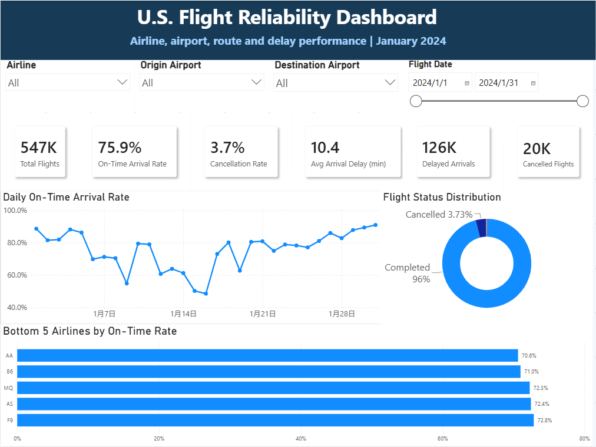
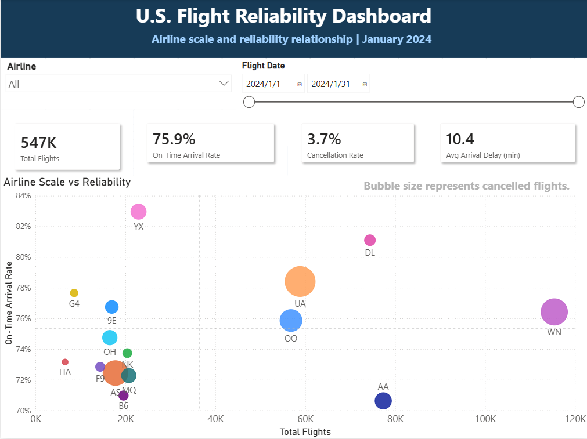
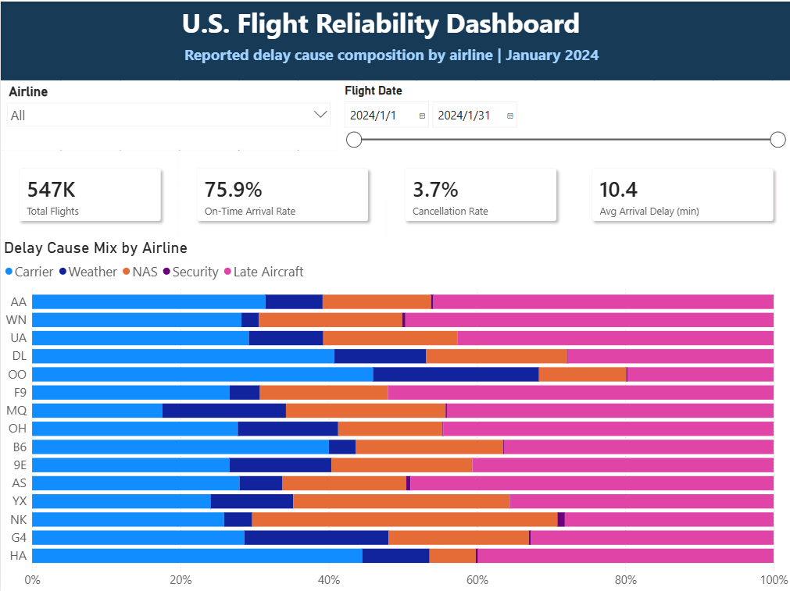
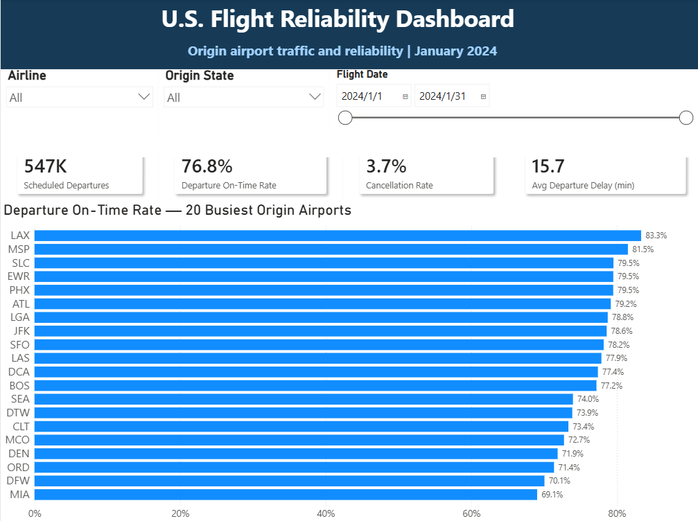
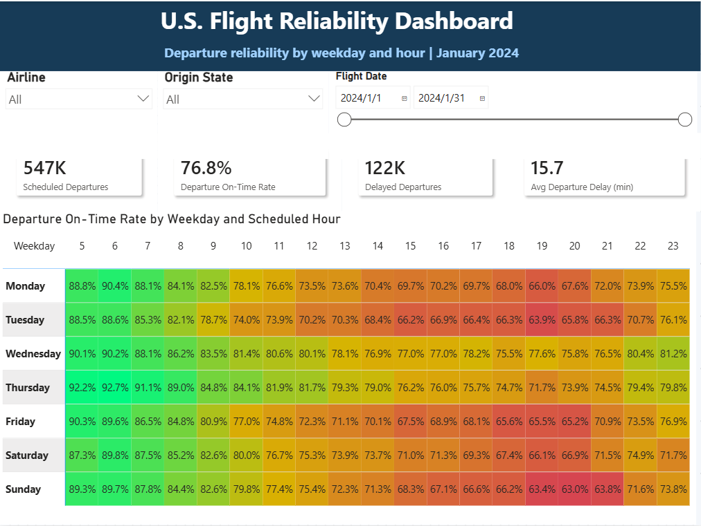
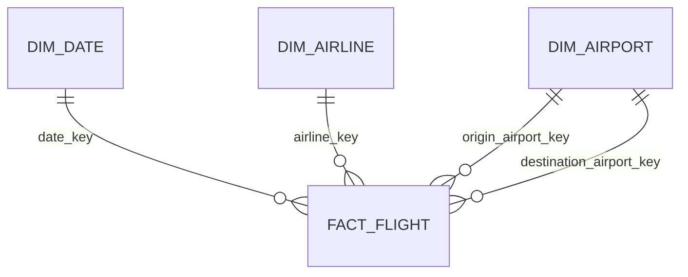

<div align="center">

# U.S. Flight Reliability Platform

Python ETL · PostgreSQL warehouse · SQL analytics · Power BI

[](https://github.com/momo840505/flight-reliability-platform/actions/workflows/tests.yml)


I built this project with U.S. Bureau of Transportation Statistics flight data. I wanted to practice the full data flow behind a dashboard, so I took the January 2024 CSV through validation, cleaning, Parquet, PostgreSQL, SQL views, and finally Power BI.

</div>

---

## What I built

For now, the project uses January 2024 data: **547,271 scheduled flight segments** across 15 reporting airlines and 334 airports. I kept it to one month while building the pipeline because it was large enough to make the validation and loading steps meaningful, but still quick enough to rerun when I changed something.

```text
BTS CSV
  ↓
raw profiling and validation
  ↓
Python cleaning and transformation
  ↓
Snappy-compressed Parquet
  ↓
PostgreSQL star schema
  ↓
warehouse reconciliation
  ↓
SQL analytics views
  ↓
Power BI report
```

I did not want this repo to be only a Power BI file. Most of the work is the data side: cleaning the source, checking bad rows, loading a small warehouse, and making sure the numbers still match after the load. The repo includes the code, SQL, tests, CI workflow, and the Power BI report I used at the end.

## Results from the January 2024 pilot

| Metric | Result |
|---|---:|
| Scheduled flights | 547,271 |
| Completed flights | 525,370 |
| Cancelled flights | 20,389 |
| Diverted flights | 1,512 |
| Reporting airlines | 15 |
| Airports | 334 |
| Arrival on-time rate | 75.9% |
| Departure on-time rate | 76.8% |
| Cancellation rate | 3.7% |
| Delayed arrivals | 126,410 |
| Delayed departures | 122,259 |
| Average arrival delay | 10.4 min |
| Average departure delay | 15.7 min |
| Raw CSV | ~141 MB |
| Clean Parquet | ~19.76 MB |

The cleaned Parquet file is about 86% smaller than the original CSV, which also made the later reloads faster while I was working on the project.

## Dashboard

### Executive overview



### Airline scale and reliability



### Delay cause mix



### Airport ranking



### Time patterns



The Power BI report contains eight pages covering overall reliability, airline ranking, airline comparison, scale versus reliability, delay causes, airport ranking, route reliability, and departure-time patterns.

## Questions I used for the dashboard

I used these questions to decide what should go into the SQL views and Power BI pages:

- How often do flights arrive and depart on time?
- Which airlines have the strongest and weakest reliability?
- Which busy origin airports combine high traffic with poor departure performance?
- Which routes have high volume and elevated delay risk?
- How does reliability change through the day and across weekdays?
- How does the reported mix of carrier, weather, NAS, security, and late-aircraft delays vary by airline?

## Architecture


```mermaid
flowchart LR
    A[BTS raw CSV] --> B[Raw validation]
    B --> C[Python transform]
    C --> D[Parquet]
    D --> E[Dimensions]
    E --> F[Flight fact]
    F --> G[Warehouse validation]
    G --> H[SQL analytics views]
    H --> I[Power BI]
```

### Storage and reporting layers

| Layer | Purpose |
|---|---|
| Raw | Unmodified BTS monthly extract |
| Interim | Profiles, validation output, temporary load files |
| Processed | Typed, compressed Parquet output |
| Warehouse | PostgreSQL dimensions and flight fact table |
| Analytics | Reusable SQL views for reporting |
| Presentation | Power BI report |

## Data source

Source: **U.S. Department of Transportation, Bureau of Transportation Statistics — Reporting Carrier On-Time Performance**.

The current checked-in code is built around the January 2024 pilot extract. Raw and processed datasets are intentionally excluded from Git because of their size.

Expected source path:

```text
data/raw/flights_2024_01.csv
```

More details are in [`data/README.md`](data/README.md).

## Warehouse model


```mermaid
erDiagram
    DIM_DATE ||--o{ FACT_FLIGHT : date_key
    DIM_AIRLINE ||--o{ FACT_FLIGHT : airline_key
    DIM_AIRPORT ||--o{ FACT_FLIGHT : origin_airport_key
    DIM_AIRPORT ||--o{ FACT_FLIGHT : destination_airport_key
```

The fact-table grain is one scheduled flight segment. Its natural uniqueness rule uses:

```text
flight date
+ reporting airline
+ flight number
+ origin airport
+ destination airport
+ scheduled departure time
```

I also put the basic rules in PostgreSQL instead of relying only on Python checks: primary and foreign keys, non-negative values, status rules, and a unique scheduled-flight constraint.

### Dimensions

`warehouse.dim_date`

- one row per calendar date
- calendar attributes are derived from `flight_date`

`warehouse.dim_airline`

- stable BTS airline ID
- reporting carrier code

`warehouse.dim_airport`

- stable BTS airport ID
- airport code, city, and state fields
- reused for both origin and destination keys

### Fact table

`warehouse.fact_flight` stores scheduled and actual timing fields, delays, taxi and elapsed time, distance, cancellation/diversion status, route, and reported delay-cause minutes.

## Analytics views

The SQL reporting layer currently includes:

- `analytics.vw_flight_detail`
- `analytics.vw_overview_metrics`
- `analytics.vw_daily_performance`
- `analytics.vw_airline_performance`
- `analytics.vw_origin_airport_performance`
- `analytics.vw_route_performance`
- `analytics.vw_departure_hour_performance`
- `analytics.vw_delay_cause_by_airline`

Power BI currently imports `analytics.vw_flight_detail` as its reporting source.

## Data checks

I validate the data three times: before cleaning, after writing Parquet, and again after loading PostgreSQL. I added the warehouse check because a script finishing without an error does not necessarily mean the loaded numbers are right.

### Raw source

Checks include:

- all selected BTS columns are present;
- `FL_DATE` parses correctly;
- year, quarter, month, day, and weekday agree with `FL_DATE`;
- flight-key fields are complete and unique;
- cancelled and diverted flags are present and valid;
- a row is not both cancelled and diverted;
- warehouse-required identifiers, codes, scheduled times, flight count, and distance are present;
- unsigned measurements are non-negative;
- `DEP_DEL15` and `ARR_DEL15` agree with their delay-minute fields;
- cancellation-code and origin/destination anomalies are reported as warnings.

### Clean Parquet

The clean validator checks the warehouse contract before loading. It verifies required values, derived calendar fields, route codes, status flags, scheduled-hour parsing, delay totals, non-negative measurements, uniqueness, and arrival-on-time logic.

### PostgreSQL warehouse

The warehouse validator reconciles source and target row counts, flight-status counts, arrival outcomes, dimension counts, natural-key uniqueness, reported delay minutes, and foreign-key resolution.

If a critical rule fails, the validator exits with an error instead of only printing `FAIL`. This was one of the things I changed after testing how the scripts behaved from PowerShell and CI.

## One time-field bug I fixed

BTS scheduled times are stored as HHMM integers. My first version only divided the value by 100 and took the hour, which meant something invalid like `2460` could turn into hour `0`. I changed the parser so normal `0000`–`2359` values and the BTS `2400` edge case are accepted, while values such as `2360`, `2460`, and `2500` are rejected.

## Warehouse loading

The loader now does the following:

1. checks the clean dataset against the warehouse contract;
2. builds date, airline, and airport dimensions;
3. verifies conflicting dimension attributes before insertion;
4. maps natural IDs to surrogate keys;
5. bulk-loads the flight fact table with PostgreSQL `COPY`;
6. reconciles the loaded fact count before the transaction commits;
7. removes the temporary CSV used by `COPY`.

I originally had the row-count check after the transaction had already committed. I moved it inside the transaction, so a count mismatch now rolls the load back instead of leaving a bad load in the database.

The loader also accepts a different Parquet input path:

```powershell
python src\load\load_warehouse.py --input path\to\clean.parquet
```

The raw validation and transformation scripts are still tied to the January 2024 file. I have written down how I would handle monthly batches, but I have not implemented that part yet.

## Tests and CI

I started with transformation unit tests, then added loader tests and a small PostgreSQL integration test after I found that some database problems cannot be caught by testing pandas code alone. GitHub Actions starts PostgreSQL 18 and runs:

- transformation unit tests;
- warehouse-helper unit tests;
- a PostgreSQL integration test;
- a smoke test against the analytics views;
- Python bytecode compilation.

The integration test uses a small test dataset. It creates the same warehouse schema and analytics views used by the project, runs the loader, and checks a few final rows and metrics. I keep the fixture small so the CI run stays fast.

See [`docs/testing_strategy.md`](docs/testing_strategy.md) for details.

## Local setup

### 1. Clone the repository

```powershell
git clone https://github.com/momo840505/flight-reliability-platform.git
cd flight-reliability-platform
```

### 2. Create a Python 3.11 environment

```powershell
py -3.11 -m venv .venv
.venv\Scripts\Activate.ps1
python -m pip install -r requirements.txt
```

### 3. Configure PostgreSQL

```powershell
Copy-Item .env.example .env
```

The default local values match `docker-compose.yml`:

```text
POSTGRES_HOST=localhost
POSTGRES_PORT=5433
POSTGRES_DATABASE=flight_reliability
POSTGRES_USER=flight_admin
POSTGRES_PASSWORD=flight_password
```

Change the password in `.env` if needed. Docker Compose reads the same environment variables, so the container and Python loader stay in sync.

### 4. Start PostgreSQL

```powershell
docker compose up -d postgres
```

The PostgreSQL 18 data volume is mounted at `/var/lib/postgresql`, matching the current official image layout.

### 5. Add the BTS source file

Place the January 2024 extract at:

```text
data/raw/flights_2024_01.csv
```

## Run the pipeline

Profile the raw extract:

```powershell
python src\validation\inspect_raw_data.py
```

Validate it:

```powershell
python src\validation\validate_raw_data.py
```

Transform it:

```powershell
python src\transform\clean_flight_data.py
```

Validate the Parquet output:

```powershell
python src\validation\validate_clean_data.py
```

Create the warehouse schema:

```powershell
$env:PGPASSWORD = "flight_password"
psql -h localhost -p 5433 -U flight_admin -d flight_reliability `
  -v ON_ERROR_STOP=1 -f sql\schema\001_create_warehouse.sql
```

Load the warehouse:

```powershell
python src\load\load_warehouse.py
```

For a complete reload:

```powershell
python src\load\load_warehouse.py --replace
```

Validate PostgreSQL:

```powershell
python src\validation\validate_warehouse.py
```

Create the analytics views:

```powershell
psql -h localhost -p 5433 -U flight_admin -d flight_reliability `
  -v ON_ERROR_STOP=1 -f sql\analytics\001_create_analytics_views.sql
```

Open the Power BI file:

```text
powerbi/flight_reliability_dashboard.pbix
```

## Project structure

```text
flight-reliability-platform/
├── .github/workflows/tests.yml
├── data/
│   ├── README.md
│   ├── raw/
│   ├── interim/
│   └── processed/
├── docs/
│   ├── images/dashboard/
│   ├── incremental_loading_design.md
│   └── testing_strategy.md
├── powerbi/
│   └── flight_reliability_dashboard.pbix
├── sql/
│   ├── analytics/001_create_analytics_views.sql
│   └── schema/001_create_warehouse.sql
├── src/
│   ├── contracts.py
│   ├── database.py
│   ├── load/
│   │   ├── load_warehouse.py
│   │   └── test_database_connection.py
│   ├── transform/
│   │   └── clean_flight_data.py
│   └── validation/
│       ├── inspect_raw_data.py
│       ├── validate_raw_data.py
│       ├── validate_clean_data.py
│       └── validate_warehouse.py
├── tests/
│   ├── test_clean_transform_helpers.py
│   ├── test_load_helpers.py
│   └── test_postgres_integration.py
├── .env.example
├── docker-compose.yml
├── pyproject.toml
├── requirements.txt
└── README.md
```

## What is still missing

This is still a student portfolio project, not a finished production platform. The main gaps are:

- The checked-in pipeline still uses one month of source data.
- Multi-month batch discovery and load-control metadata are designed but not implemented.
- Airline names are not yet joined from a separate reference table.
- Airport latitude, longitude, and time-zone data are not included.
- Weather is represented by BTS reported weather-delay minutes rather than external meteorological data.
- The Power BI report is stored as a `.pbix` binary, so its model and DAX are not diff-friendly in Git.
- The project is descriptive; it does not include a delay-prediction model.
- There is no cloud deployment in this repository.

## What I would add next

If I continue this project, I would work on these in roughly this order:

1. monthly batch ingestion with a checksum-based load-control table;
2. a source manifest for reproducible BTS extracts;
3. dbt models/tests for the analytics layer;
4. migration of the Power BI report to PBIP/TMDL for source control;
5. scheduled deployment on AWS or Azure with secrets and monitoring.

The proposed incremental-load design is documented in [`docs/incremental_loading_design.md`](docs/incremental_loading_design.md).

## Tools used

- Python 3.11
- pandas
- PyArrow / Parquet
- psycopg 3
- PostgreSQL 18
- SQL
- Power BI / DAX
- Docker Compose
- pytest
- GitHub Actions

## License

MIT

## Data acknowledgement

Flight-performance data comes from the U.S. Department of Transportation Bureau of Transportation Statistics. This is my own student portfolio project and is not affiliated with the department.
